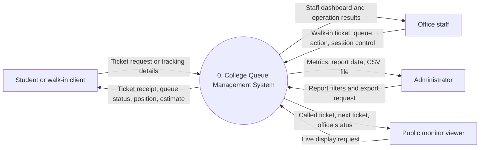
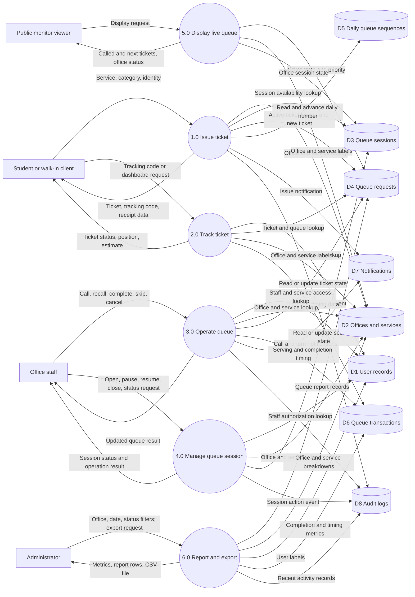
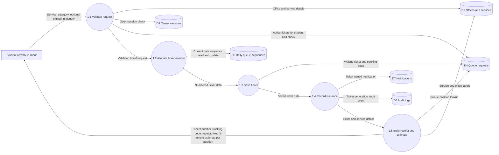
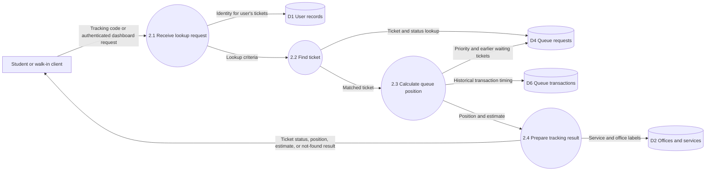
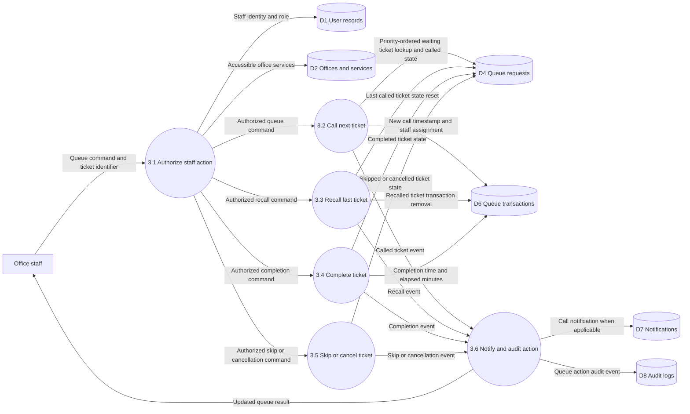
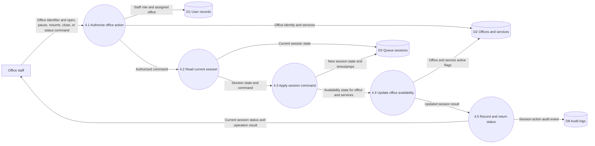
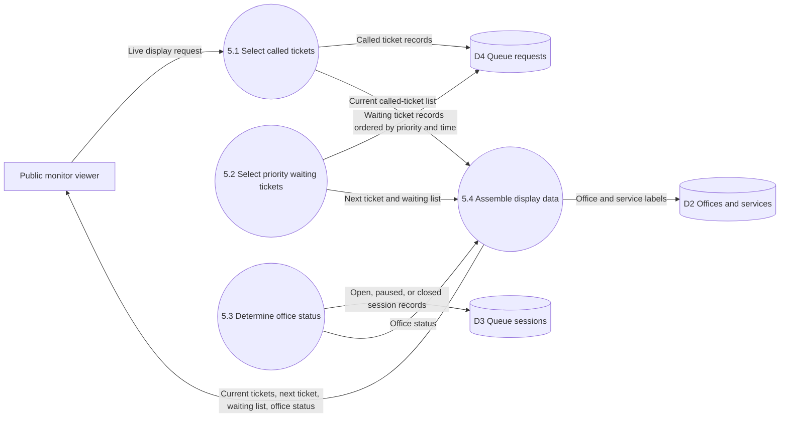
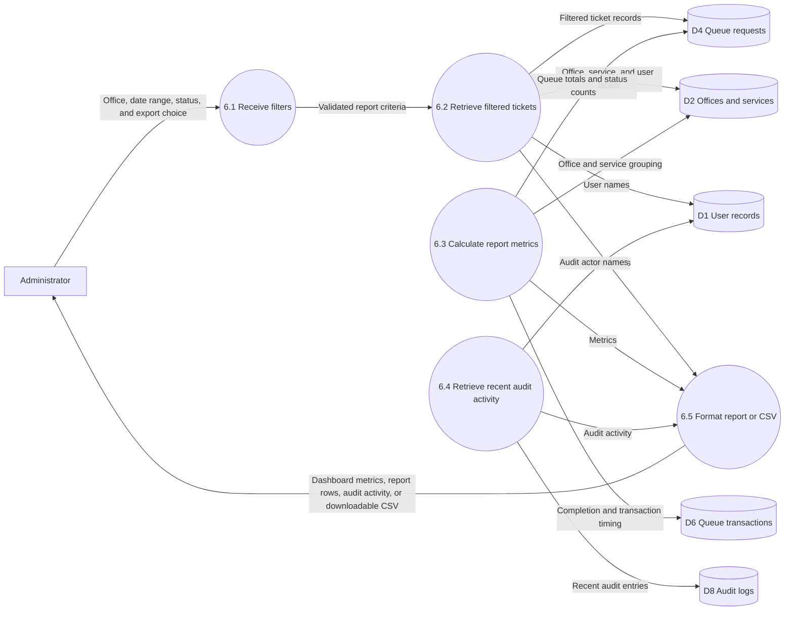

# Queue Management System Data Flow Diagrams

This document uses the common capstone convention in which **Level 0** is the context diagram. The system is decomposed through **Level 2**, where each major process is detailed into its principal sub-processes, data stores, inputs, and outputs. Level 3 is not included because it would mostly describe controller-level validation and implementation logic rather than additional system functions.

## Level 0: Context Diagram

The system is represented as one process. External entities exchange data with it; internal data stores are intentionally omitted at this level.

## Level 1: Major Processes

Level 1 decomposes process 0 into the six major functions. The store identifiers are reused in every Level 2 diagram.

## Level 2: Process Decomposition

### 1.0 Issue Ticket

### 2.0 Track Ticket

### 3.0 Operate Queue

### 4.0 Manage Queue Session

### 5.0 Display Live Queue

### 6.0 Report and Export

## Data Store Definitions

| ID | Data store | Principal contents |
| --- | --- | --- |
| D1 | User records | Student, staff, and administrator identities and office assignments |
| D2 | Offices and services | Office names and status; service names, office links, and status |
| D3 | Queue sessions | Office session status, operator, and open/close timestamps |
| D4 | Queue requests | Ticket number, tracking code, owner, service, category, status, and request time |
| D5 | Daily queue sequences | Per-date last-issued ticket number |
| D6 | Queue transactions | Serving staff, call/completion timestamps, and elapsed minutes |
| D7 | Notifications | In-app, display, audio, and office notification records |
| D8 | Audit logs | Recorded ticket, queue, and session actions |

## Business Rules and Scope Notes

- A ticket request is accepted only for an active office and service with an open queue session. Signed-in students are limited to two active tickets; walk-in tickets may have no linked user.
- Queue priority is PWD and senior first, followed by regular tickets; tickets within a priority group are ordered by request time.
- The implemented daily sequence starts at 100 and uses the 100–600 range. **Current code wraps to 100 again if a same-day request advances past 600.** If the capstone requirement is to stop issuance at 600 for that day, that behavior must be changed in the application.
- `queue_requests` stores the ticket status. `queue_transactions` stores the call and completion timing. The new-ticket receipt estimate is three minutes per position; tracking lookup instead uses the average `wait_minutes` from completed transactions. The application computes `wait_minutes` from `called_at` to `completed_at` (elapsed service time), so it represents service duration rather than time spent waiting before service.
- Report row and office-breakdown filters use the selected office, date range, and status. The headline summary cards and recent audit activity are global/current data and are not all scoped to those filters.
- The public monitor aggregates tickets across offices. It refreshes display data in the client and reports Open if any session is open, otherwise Paused if any session is paused, otherwise Closed.
- Notifications are stored in the application database for in-app, display, and audio behavior; this diagram does not imply an external SMS gateway.

## Implementation References

- Routes and role-protected workflows: [routes/web.php](routes/web.php)
- Ticket issuance, tracking, and monitor data: [app/Http/Controllers/QueueController.php](app/Http/Controllers/QueueController.php)
- Staff queue operations: [app/Http/Controllers/DashboardController.php](app/Http/Controllers/DashboardController.php)
- Session controls: [app/Http/Controllers/QueueSessionController.php](app/Http/Controllers/QueueSessionController.php)
- Analytics and CSV export: [app/Http/Controllers/Admin/ReportsController.php](app/Http/Controllers/Admin/ReportsController.php)